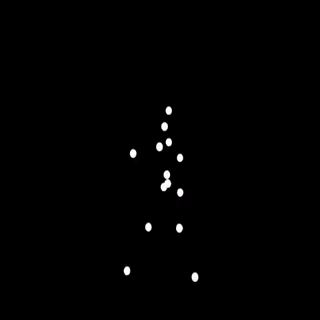

# {data-background-image=assets/apostles.jpg}

::: {style="text-align: right;padding-right:0.5em;font-size:3em"}
Hello, world!
:::

::: notes
You might have guessed, I have not always been a computer scientist.
In the past, I travelled the world with a camera taking photographs for design and advertising clients.
When I first started taking pictures commercially, one used film...
Large format film, with cameras not dissimilar to Victorian photographers.
:::

## {data-background-image=assets/mini-portfolio.jpg}

::: notes
I have no doubt that I have been really fortunate to be able to do what I have done.
I've included a few images here I have taken - just a few, which I have enjoyed taking over the years.
Now, you might be wondering what has this go to do with lecturing in computer science?
:::

## {data-background-image=assets/face_intervals.jpg}

::: notes
Like all of us, I've also travelled through time.
As time passed by, computers became an increasingly important part of my work.
My interest in cameras and images transitioned into an interest in computers and computer vision.
I became particularly interested in how computers understand pictures of people.
:::

## {data-background-image=assets/head_scan.jpg}

::: notes
Eventually, I formalised my interest in computing with a PhD thesis on Speech Animation.
I was very fortunate, before coming to the University to lecture, to both for Disney Research and Facebook Reality labs.
There, our focus was on Digital Humans - how we can represent ourselves socially in a digital world.
I still worked with cameras and images, but now objectively, for data collection.
:::

# Computer Science {data-background-image=assets/ENIAC.jpg}

::: notes
Now I am here to lecture in Computer Science, so let's talk about that.
Computer science is the study of computation, automation, and information.
My favourite definition is to say - Computer scientists are problem solvers.
It deals with both software and hardware, and has existed long before the electronic computer, although as a field it grew rapidly in the middle of the 20th century.
This is ENIAC the first electronic, Turing-complete device, which performed ballistics trajectory calculations for the United States Army.
:::

## Equations

::: {style="font-size:0.75em;"}

$$
X_{u, v} = s_u s_v ~ \sum_{x=0}^{N-1} \sum_{y=0}^{N-1} I(x, y) ~
    cos \left[ \frac{\pi u (2x + 1)}{2N} \right]
    cos \left[ \frac{\pi v (2y + 1)}{2N} \right]
$$

:::

::: notes
Many students who study computer science can be intimidated by some of the mathematics involved.
Mathematic notation is really useful for formally describing some of the ideas in computer science.
The equation here is the Discrete Cosine Transform - it looks complicated - but really it is just telling us an image can be constructed from the sum of some frequencies.
The DCT is used in JPEG compression.
:::

## Source code

```{.python data-line-numbers="4-5"}
class Net(nn.Module):
    def __init__(self):
        super(Net, self).__init__()
        self.conv1 = nn.Conv2d(1, 32, 3, 1)
        self.conv2 = nn.Conv2d(32, 64, 3, 1)
        self.dropout1 = nn.Dropout(0.25)
        self.dropout2 = nn.Dropout(0.5)
        self.fc1 = nn.Linear(9216, 128)
        self.fc2 = nn.Linear(128, 10)
```

::: notes
The more practical side of computer science does involve writing code.
This is the constructor for a PyTorch Neural Network to classify images of hand written digits.
It uses one of the fundamental components of neural networks: convolutional layers.
I have highlighted the code for the convolutional layers.
:::

# Computer Vision {data-background-image=assets/matrix.gif}

::: notes
My teaching area is computer Vision.
Computer Vision means to take the low level data - the numbers or values in an image file - and turn it into high level information that humans can understand.
For example an image of a cat - the computer only has numbers, humans see a cat, how do we make a computer recognise that those numbers represent a cat?
:::

## {data-background-image=assets/ffhq.jpg}

::: notes
My research interest includes human faces.
Human faces are incredibly difficult to work with - not least because of how well tuned we **all** are to recognise faces.
We exist with such beautiful diversity - and we carry an enormous range of expression and articulation in our faces.
However, we can do quite a lot with modern techniques - for example it is now quite straightforward to recognise these diverse images as faces.
:::

## {data-background-image=assets/stylegan.jpg}

::: notes
We can describe faces parametrically.
I could offer you the idea of a parametric face by listing some possible parameters.
How about hair colour, eye colour, and lip colour?
What about how far between the eyes - or the mouth width?
How deep are the wrinkles in the skin?

You might be surprised that all the images in the this slide were generated from such parameters.
:::

## {data-background-image=assets/faces.gif}

::: notes
Maybe you were surprised that all the images in the previous slide were generated from parameters.
Thes are not the semantic parameters I used as an example - but a deep compression of many images of faces.
We call this a generative model. It means that we can generate **new** faces - faces never seen during training - faces of people that do not exist.

:::

# {data-background-image=assets/eclipse.jpg}

::: notes
As I reflect on the tasks ahead - I have a module where the students must make a presentation of there findings.
I want to offer some concise guidelines for making presentations.
This is of particular relevance for me as I have a visual defect, caused by looking at the sun during an eclipse event.
It happened a long time ago, I mostly have leant to live with it - but it does give me some reading difficulties if the text is too small.
:::

##

{width=50%}

::: notes
We are very receptive to both detecting motion.

Think of trying to have a conversation with someone - while a television is on behind them.
Even with the sound off - it really pulls on your attention.

Visual perception of biological motion and a model for its analysis. Gunnar Johansson.
It is found that 10–12 such elements in adequate motion combinations in proximal stimulus evoke a compelling impression of human motion.
:::

## {data-background-image=assets/mondrian.jpg}

::: notes
Piet Mondrian eventually decided to limit his formal vocabulary to the three
primary colors (red, blue and yellow),
the three primary values (black, white and gray)
and the two primary directions (horizontal and vertical).
:::

## {data-background-image=assets/size.jpg}

::: notes
One easy way to draw attention or make a point is to make the text bigger.
Notice how the large text is more compelling than the small text.
Often slide software reverses the emphasis of the text - larger headlines and smaller descriptive text.
We can change it if we want...
:::

## {data-background-image=assets/dice.jpg}

::: notes
It requires 500% more cognitive effort to count than to recognise.
The greatest number of objects we can recognise is SIX.
Our energy conserving brains weigh up the effort to count or ignore - and choose ignore...
:::

## {data-background-image=assets/columbia_slide.png}

::: notes
This one we are all guilty of...
Due to the redundancy effect in working memory: speaking while having sentences on screen results in very low recollection by audience.
The redundancy principle (or redundancy effect) suggests that redundant material interferes with rather than facilitates learning.
From: The Redundancy Principle in Multimedia Learning (2014) John Sweller. Richard E. Mayer

Edward Tufte analysed this slide...
:::

## {data-background-image=assets/columbia_2003.jpg}

::: notes
Edward Tufte analysed this slide...
He found the complex hierarchy and de-emphasis of the most important points contributed to the engineers at NASA not recognising the possibility of damage to the re-entry shields of the Columbia.
The catastrophic consequences resulted in the unfortunate loss of all 7 crew members.
:::

# Distribution

All code available [here](https://github.com/uea-teaching/pecha-kucha).

::: notes
To wrap up the presentation, I will mention that I did NOT use PowerPoint.
I can't use powerpoint - the amount of buttons fills me with anxiety at the very sight of them.
Worse, powerpoint fails to provide the tools I need - it does not have a means for showing source code, or a standard way of showing equations.
I prefer to write my material in a plain text format that anyone can view or edit.
As such, I have made all my code available at the link so you can see for yourself.
:::
